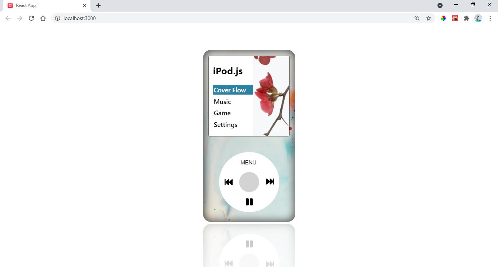
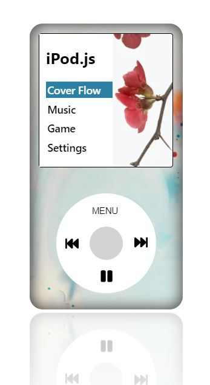
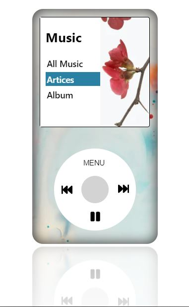
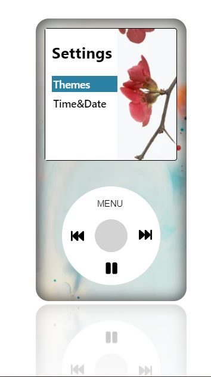

# Build an iPod using React.js.

# Preview

## Screen



### Home Screen



### Music Screen



### Setting Screen



## Directory Structure

```
/src - all code files
/src/components - all react components
/src/css - all css files
/src/img - all img files
```
